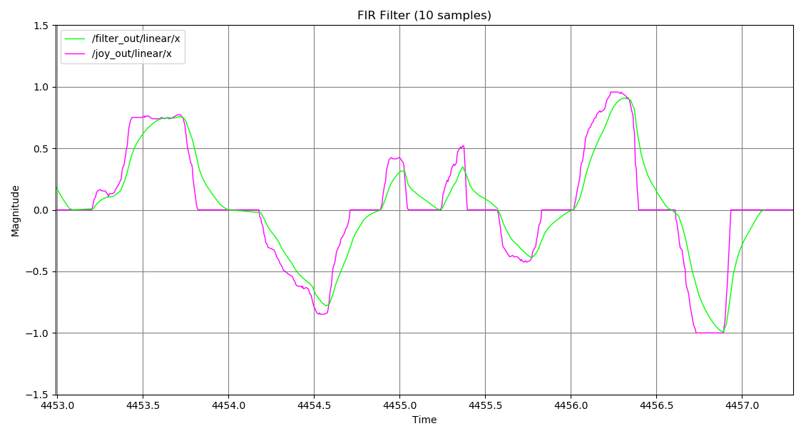

# Dynamic Twist Filter

This package is designed to work with the ROS framework to filter twist messages via ROS topics. There are two layers of filtering: individual signal filtering and over atwist filtering. The user can dynamically adjust the overall twist filter parameters like maximum acceleration and maximum velocity for both the linear and angular components of the twist. There are three kinds of filters available: a moving average filter, a more generic FIR filter, and an IIR filter.

This package is inspired by a few other twist filters that already exist, but they do not offer much as functionality or are specifically designed for a certain application. This twist filter aims to be more generic and versatile while being maintained as a standalone package. Two popular packages, [`cob_base_velocity_smoother`](https://github.com/ipa320/cob_control/tree/kinetic_dev/cob_base_velocity_smoother) and [`yocs_velocity_smoother`](https://github.com/yujinrobot/yujin_ocs/tree/devel/yocs_velocity_smoother), only look at the linear x, y, and angular z components. They also do not offer component-level filtering or different filter configurations.

## Build Instructions

*NOTE: This package has only been tested on Ubuntu 18.04 running ROS Melodic*

1. Clone the package to your catkin workspace and run `catkin_make`.
2. Source your workspace.

## Run Instructions

Run the filters with their respective launch files:

``` bash
$ roslaunch twist_filter avg_filter.launch      // Moving average filter

$ roslaunch twist_filter fir_filter.launch      // FIR filter

$ roslaunch twist_filter iir_filter.launch      // IIR filter
```

You can remap the input and output filter topics as well:

``` bash
$ roslaunch twist_filter avg_filter.launch input:=cmd_in output:=cmd_out
```

You can also specify which motion configuration profile you would like to use:

``` bash
$ roslaunch twist_filter fir_filter.launch config:=fir_config.yaml
```

*NOTE: Motion config profiles must be `.yaml` files that are saved in the `/config` directory of the package.*

### Reconfiguration

You can update the motion profile values in real time by publishing to the `/filter_config` topic:

``` bash
$ rostopic pub /filter_config twist_filter/FilterConfig "linear_vel_max: 0.7
> linear_acc_max: 1.0
> angular_vel_max: 0.7
> angular_acc_max: 1.0"
```

## How it Works

As mentioned above, there are two layers of filtering involved. The initial filtering happens at the component level of each twist. The linear and angular x, y, and z components are all filtered with either the MA, FIR, or IIR component filters. For every incoming twist, the signal is broken down into its components, filtered, and then reconstructed to make a smoothed signal.


The smoothed signal is then passed to the higher level filter which looks at the twist as a whole rather than its individual components. The linear and angular magnitudes of both velocity and acceleration are calculated and then compared to the maximum values specified by the user (either from the motion config profile or from reconfigurations during runtime via the configuration topic). If any of the magnitudes cross the specified threshold, the entire twist is scaled accordingly so that the output twist is entirely constrained by the motion config profile. All components are scaled the same amount to preserve the motion of the original twist. This level of filtering can also be skipped if the maximum limits are set to 0.

## Samples

The following images are samples of the linear X component of an incoming signal from a PS3 controller. The `joy` package was used to read the controller data as inputs to generate a twist.

### Component Level Filters

#### Moving Average Filter

Response from a 10-sample moving average filter. Input is in blue and output is in red.


#### FIR Filter

Response from a 10-sample FIR filter with the following weights: [0.35, 0.15, 0.1, 0.1, 0.05, 0.05, 0.05, 0.05, 0.05, 0.05]. Input is in blue and output is in red.



#### IIR Filter

Response from an IIR filter with a 10-sample input with the following weights: [0.35, 0.15, 0.1, 0.1, 0.05, 0.05, 0.05, 0.05, 0.05, 0.05]; and a 5-sample feedback output with the following weights: [0.1, 0.2, 0.2, 0.25, 0.25]. Input is in blue and output is in red.


### Twist Level Filters

The following twist level filters were done on twists smoothed with 10-sample FIR component filters with the following weights: [0.35, 0.15, 0.1, 0.1, 0.05, 0.05, 0.05, 0.05, 0.05, 0.05].

#### Velocity Limiting

Response to a velocity constrait at +/- 0.7 (original input is from +/- 1.0). Input is dark blue, component filtering is red, and final twist filtering is light blue.


#### Acceleration Limiting

Response to an acceleration constraint of +/- 1.0 (original input had no limit). Input is dark blue, component filtering is red, and final twist filtering is light blue.


#### Velocity and Acceleration Limiting

Response to both a velocity (+/- 0.7) and acceleration (+/- 1.0) constraint. Input is dark blue, component filtering is red, and final twist filtering is light blue.

